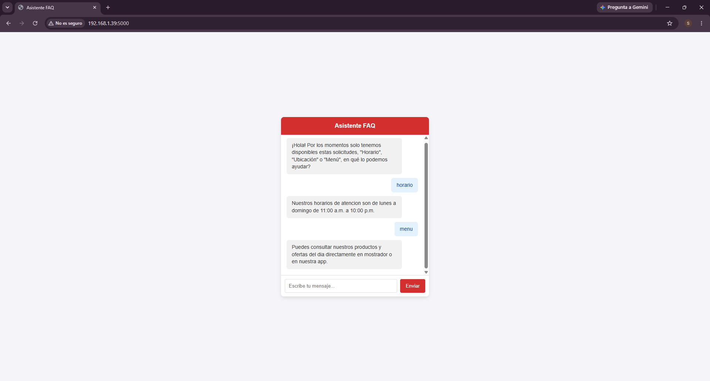

# Bot de Atención Rápida (Asistente FAQ)

- Descripción: Proyecto de práctica enfocado en el desarrollo backend y la gestión de webhooks. Consiste en una API ligera construida en Python que procesa mensajes de texto mediante rutas POST, evalúa palabras clave
  y devuelve respuestas estructuradas en formato JSON.

- Tecnologías utilizadas: Python, Flask y HTML/JavaScript.

- Enfoque actual: Como estudiante de Ingeniería en Informática, este proyecto me ha permitido comprender a fondo cómo interactúan los sistemas cliente-servidor, el intercambio de datos
  mediante APIs y las bases lógicas detrás de la optimización de chatbots.
  

### Vista previa del programa

